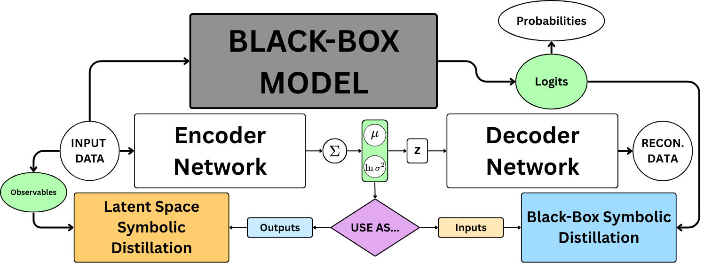

# Symbolic Distillation of Black-Box Jet Taggers via Autoencoder Latent Spaces

This repo includes a two-step symbolic distillation framework to interpret deep learning jet taggers, along with its accompanying experiments.



## Overview

As deep learning (DL) models used for high-energy jet tagging become increasingly complex, they lose their interpretability, becoming black-boxes. Symbolic distillation, the process of "distilling" the knowledge of a DL "teacher" into a "student" symbolic regression algorithm, has found success in opening the black box. However, the increasing usage of particle clouds as inputs to DL models has created an input format discrepancy between neural networks and equations. We introduce a framework that uses the latent space of a variational autoencoder to (1) compress particle cloud input data into a tabular set of variables interpretable with jet observables and (2) serve as inputs for symbolic surrogates.

## Getting Started

### Dependencies

Much of this framework is built upon the weaver-core machine learning framework, which utilizes PyTorch and Python >= 3.10. All dependencies useable within experiments involving the framework can be installed as a conda environment using the environment.yml file. This framework assumes CUDA is installed.

### Running Scripts

Before any scripts can be run, a work directory variable must be defined:

```bash
export WORKDIR=/path/to/workdir
```

From there, you may download the JetClass, QuarkGluon, or TopLandscape datasets from the dataset utils provided by the [Particle Transformer repo](https://github.com/jet-universe/particle_transformer.git).

```bash
cd ${WORKDIR}/datasets/utils
./get_datasets.py [JetClass|QuarkGluon|TopLandscape] -d ${WORKDIR}/datasets
```

Currently, the framework script is only compatible with the JetClass dataset for binary classification. A full implementation of the framework can be found in the experiments/ folder:

```bash
cd ${WORKDIR}/experiments
./run_experiments.sh
```

Pre-trained DL models can be found in the outputs/models/ folder, separated by their jet tagging task. These are the models that are used in the experiment scripts. 